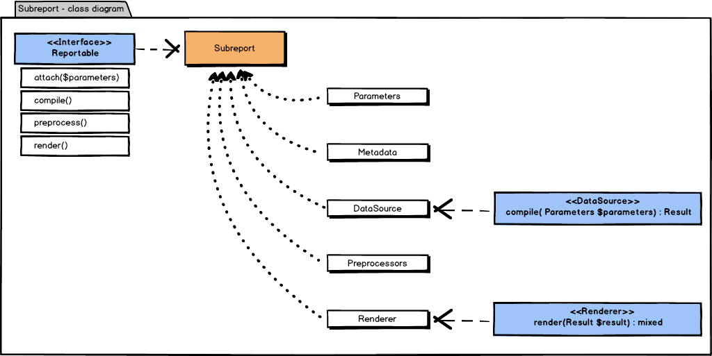
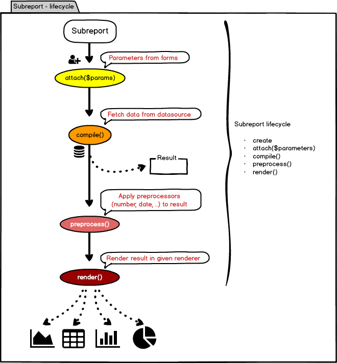

# Model

## Group

Contains individual reports.

| Property   | Type     | Description     |
|------------|----------|-----------------|
| `$id`      | string   | Group ID        |
| `$name`    | string   | Group name      |
| `$reports` | Report[] | List of reports |

## Report

Root entity. Contains individual subreports, which renders charts and tables.

| Property       | Type        | Description        |
|----------------|-------------|--------------------|
| `$id`          | string      | Report IT          |
| `$metadata`    | Metadata    | Metadata           |
| `$subreports`  | Subreport[] | List of subreports |

## Subreport

Entity which contains data source, renderer and preprocessors.
Handles load, transformation and render of data.

- Load => through data source
- Transformation => through preprocessors
- Render => through renderer

## Class diagram

## Life cycle

## Services

Simplifies usage in presenters and components.

### ReportManager

For basic operations with groups.

- `addGroup(Group $group): void`
- `hasGroup(string $gid): bool`
- `getGroup(string $gid): Group`
- `getGroups(): Group[]`
- `addGroupless(Report $report): void`
- `getGrouppless(): Report[]`

It is used primarily in `ReportExtension`, through which are automatically
added groups and groupless reports.

### ReportService

Wraps `ReportManager` for manipulation with reports.

- `getReport(string $rid): ?Report`
- `getGroups(): Group[]`
- `getGroupless(): Report[]`
