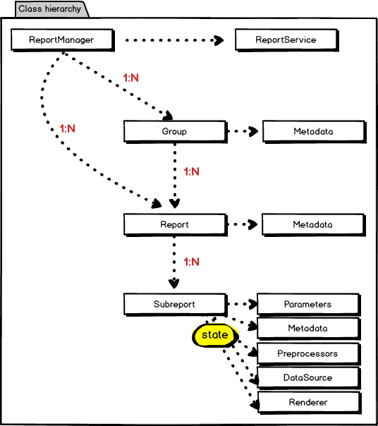

# Tlapnet Report

[](https://travis-ci.org/tlapnet/report)
[](https://coveralls.io/r/tlapnet/report)
[](https://packagist.org/packages/tlapnet/report)
[](https://packagist.org/packages/tlapnet/report)
[](https://packagist.org/packages/tlapnet/report)
[](https://packagist.org/packages/tlapnet/report)
[](https://github.com/phpstan/phpstan)

## Install

```
$ compose require tlapnet/report
```

## Versions

| State       | Version | Branch   | PHP      |
|-------------|---------|----------|----------|
| dev         | `^0.6`  | `master` | `>= 7.2` |
| stable      | `^0.5`  | `master` | `>= 7.2` |

## Documentation

- [Nette - integration with Nette](.docs/nette.md)
- [Model - entities and services](.docs/model.md)
- [DataSources - data sources](.docs/datasources.md)
- [Renderers - tables and graphs rendering](.docs/renderers.md)
- [Parameters - form creation](.docs/parameters.md)
- [Preprocessors - data decorators](.docs/preprocessors.md)
- [Fetcher - data fetching](.docs/fetcher.md)
- [Exports - data exporting](.docs/exports.md)

## Classdiagram



## Maintainers

<table>
  <tbody>
    <tr>
      <td align="center">
        <a href="https://github.com/f3l1x">
            
        </a>
        </br>
        <a href="https://github.com/f3l1x">Milan Felix Šulc</a>
      </td>
      <td align="center">
        <a href="https://github.com/mabar">
            
        </a>
        </br>
        <a href="https://github.com/mabar">Marek Bartoš</a>
      </td>
    </tr>
  <tbody>
</table>
