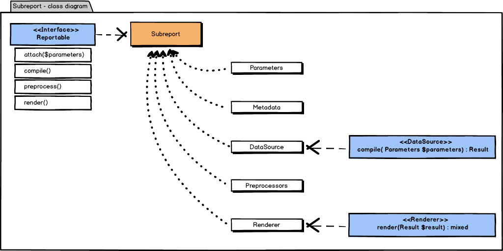
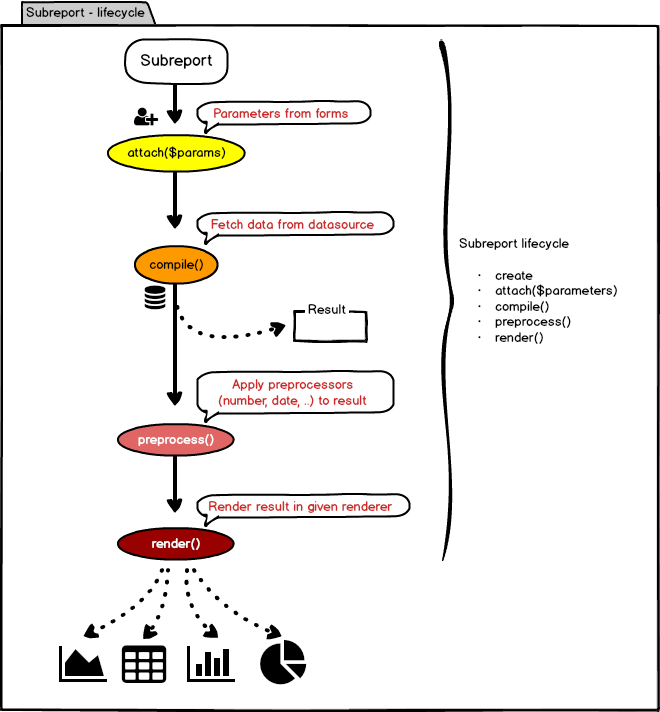

# Report

## Instalace

```
$ compose require tlapnet/report
```

## Základní prvky

- Entities
- DataSources
- Preprocessors
- Renderers
- Services

## Classdiagram


## Entities

### Group

Obsahuje jednotlivé reporty.

| Property   | Typ    | Popisek       |
|------------|--------|---------------|
| `$id`      | string | ID skupiny    |
| `$name`    | string | Název skupiny |
| `$reports` | array  | Pole reportů  |

### Report

Základní stavební kámen. Obsahuje jednotlivé subreporty, které vykreslují 
grafy, tabulky apod.

| Property       | Typ       | Popisek           | 
|----------------|-----------|-------------------|
| `$id`          | string    | ID reportu        |
| `$metadata`    | object    | Metadata          |
| `$subreports`  | array     | Pole reportů      |

### Subreport

Konečná komponenta obsahující data source, renderer a preprocessors.
Stará se o načtení, převedení a vykreslení dat formou delagace.

- Načtení => přes data source 
- Převedení => přes preprocessors 
- Vykreslení => přes renderer 

### Class diagram



### Životní cyklus



## Parameters

Skrze parametry lze filtrovat a upravovat výstup z datasource. Resp. upravovat jeho SQL dotaz.

Základní konfigurace může vypadat třeba takto.

```yaml
params:
	builder:
		- addText({
			name: ID
			title: Identificator
		})
		- addSelect({
			name: UID
			title: Unified ID
			items: [POST, GET, DELETE]
		})
```

Všechny specialní parametry jsou pod klíčem builder, protože pro svoje sestavení používají 
`ParametersBuilder`.

`ParametersBuilder` podporuje tyto typy parametrů:

| Method      | Type   | Options            |
|-------------|--------|--------------------|
| `addText`   | TEXT   | name, title        |
| `addSelect` | SELECT | name, title, items |

`ParametersBuilder` vytvorí podle parametrů dle zadaných konfigurací a předá ho do subreportu.
Při vykreslování subreportu se pak ověřuje, zda-li existují nějaké parametry a je případně
vykreslen formulář.

Formulář je defaulně nevyplněný a input nejsou povinné. Při odeslání formuláře bez dat se nic neprovede,
až pokud se vyplnít alespoň 1 input / parameter. Výsledný vyhledávací dotaz se uloží do URL a je tedy možné,
odeslat někomu link a tomu se zobrazí stejný výstup.

## DataSources

DataSource implementuje metodu `compile`.

```php
/**
 * @param Parameters $parameters
 * @return Resultable
 */
public function compile(Parameters $parameters);
```

Vrací nám objekt `Result`, který v sobě má veškerá data potřebná k vykreslení.

Připravené implementace:

- [ArrayDataSource](https://git.tlapnet.cz/libs/report/blob/master/src/DataSources/ArrayDataSource.php)
- [CallbackDataSource](https://git.tlapnet.cz/libs/report/blob/master/src/DataSources/CallbackDataSource.php)
- [DevNullDataSource](https://git.tlapnet.cz/libs/report/blob/master/src/DataSources/DevNullDataSource.php) (pro testování)
- [DummyDataSource](https://git.tlapnet.cz/libs/report/blob/master/src/DataSources/DummyDataSource.php) (pro testování)
- [PdoDataSource](https://git.tlapnet.cz/libs/report/blob/master/src/DataSources/PdoDataSource.php)
- [RestDataSource](https://git.tlapnet.cz/libs/report/blob/master/src/DataSources/RestDataSource.php) (@TODO)

Nette bride:

- [NetteDatabaseDataSource](https://git.tlapnet.cz/libs/report/blob/master/src/Bridges/Nette/Database/DataSources/NetteDatabaseDataSource.php)
- [NetteDatabaseWrapperDataSource](https://git.tlapnet.cz/libs/report/blob/master/src/Bridges/Nette/Database/DataSources/NetteDatabaseWrapperDataSource.php) (obaluje nette database connection)
- [MultiNetteDatabaseWrapperDataSource](https://git.tlapnet.cz/libs/report/blob/master/src/Bridges/Nette/Database/DataSources/MultiNetteDatabaseWrapperDataSource.php) (obaluje nette database connection + obsahuje více sql dotazů)

Dibi bridge:

- [DibiDataSource](https://git.tlapnet.cz/libs/report/blob/master/src/Bridges/Dibi/DataSources/DibiDataSource.php)
- [DibiWrapperDataSource](https://git.tlapnet.cz/libs/report/blob/master/src/Bridges/Dibi/DataSources/DibiWrapperDataSource.php) (obaluje dibi connection)
- [MultiDibiWrapperDataSource](https://git.tlapnet.cz/libs/report/blob/master/src/Bridges/Dibi/DataSources/MultiDibiWrapperDataSource.php) (obaluje nette dibi connection + obsahuje více sql dotazů)

## Preprocessors

Preprocessor implementuje metodu `preprocess`.

```php
/**
 * @param mixed $data
 * @return mixed
 */
public function preprocess($data);
```

Preprocessor se nasazuje na jednotlivý sloupeček dat/resultu. A aplikuje se
na všechny výstkyty.

Připravené implementace:

- [AppendPreprocessor](https://git.tlapnet.cz/libs/report/blob/master/src/Model/Preprocessor/Impl/AppendPreprocessor.php) (přidá nakonec)
- [CurrencyPreprocessor](https://git.tlapnet.cz/libs/report/blob/master/src/Model/Preprocessor/Impl/CurrencyPreprocessor.php) (formátuje měnu)
- [DatePreprocessor](https://git.tlapnet.cz/libs/report/blob/master/src/Model/Preprocessor/Impl/DatePreprocessor.php) (formátuje čas)
- [DevNullPreprocessor](https://git.tlapnet.cz/libs/report/blob/master/src/Model/Preprocessor/Impl/DevNullPreprocessor.php) (pro testování)
- [NumberPreprocessor](https://git.tlapnet.cz/libs/report/blob/master/src/Model/Preprocessor/Impl/NumberPreprocessor.php) (formátuje číslo)
- [PrependPreprocessor](https://git.tlapnet.cz/libs/report/blob/master/src/Model/Preprocessor/Impl/PrependPreprocessor.php) (přidá na začátek)

## Renderers

Renderer implementuje metodu `render`.

```php
/**
 * @param Result $report
 * @return mixed
 */
public function render(Result $report);
```

Renderer nám vykreslí data do určité grafické podoby (tabulka, graf, apod.).

Připravené implementace:

- [CallbackRenderer](https://git.tlapnet.cz/libs/report/blob/master/src/Renderers/CallbackRenderer.php)
- [CsvRenderer](https://git.tlapnet.cz/libs/report/blob/master/src/Renderers/CsvRenderer.php)
- [DevNullRenderer](https://git.tlapnet.cz/libs/report/blob/master/src/Renderers/DevNullRenderer.php) (pro testování)
- [DummyRenderer](https://git.tlapnet.cz/libs/report/blob/master/src/Renderers/DummyRenderer.php) (pro testování)
- [JsonRenderer](https://git.tlapnet.cz/libs/report/blob/master/src/Renderers/JsonRenderer.php)
- [TableRenderer])(https://git.tlapnet.cz/libs/report/blob/master/src/Renderers/TableRenderer.php)

Nette bridge:

- TableRenderer (sloupečky, řazení)
- SimpleTableRenderer (sloupečky)

## Services

Knihovna je především tvořena jednotlivými entitami, ale jsou tu i 2 služby pro
pohodlnější praci v presenterech a komponentách.

### ReportManager

Podporuje uplně základní operace se skupinami.

- `addGroup(Group $group)`
- `hasGroup($gid)`
- `getGroup($gid)`
- `getGroups()`
- `addGroupless(Report $report)`
- `getGrouppless()`

Používá se především v `ReportExtension`, kde do ní Nette\DI\Container automaticky
přidává skupiny a reporty.

### ReportService

Obaluje `ReportManager` pro manipulaci s reporty.

- `getResult($rid)`
- `getGroups()`
- `getGroupless()`

## Nette

### Registrace

```yaml
extensions:
	report: Tlapnet\Report\Bridges\Nette\DI\ReportExtension
```

```yaml
report:
	# konfigurace..
```

### Konfigurace

Ukázková root konfigurace.

```yaml
# Spolecne parametery
parameters:
	report:
		db:
			driver: mysql
			host: db
			database: tlapnet
			user: root
			password: root

report:
	# Jednotlive reporty
	# Tip: idealni je mit 1 report v 1 souboru, prot lepsi prenositelnost a prehlednost
	files:
		- %module.sample.moduleDir%/config/reports/files/report.neon

	# Slozky, kde se hledaji *.neon soubory
	folders:
		- %module.sample.moduleDir%/config/reports

	# Spolecne sluzby
	definitions:
		datasource.nette.db:
			class: Tlapnet\Report\Bridges\Nette\Database\DataSources\NetteDatabaseDataSource(%report.db%)
			setup:
				- setTracyPanel(%debugMode%)
				
		# Pokud v applikaci mate uz zaregistrovany Nette\Database\Connection, staci pouzit tento wrapper
		datasource.nette.db.wrapper:
			class: Tlapnet\Report\Bridges\Nette\Database\DataSources\NetteDatabaseWrapperDataSource
			setup:
				- setTracyPanel(%debugMode%)

		datasource.dibi.db:
			class: Tlapnet\Report\Bridges\Dibi\DataSources\DibiDataSource(%report.db%)
			
		# Pokud v applikaci mate uz zaregistrovany DibiConnection, staci pouzit tento wrapper
		datasource.dibi.db.wrapper:
			class: Tlapnet\Report\Bridges\Dibi\DataSources\DibiWrapperDataSource
			
		# Ciste reseni pres PDO
		datasource.pdo.db:
			class: Tlapnet\Report\DataSources\PdoDataSource(%report.db%)

	# Zaregistrovane skupiny
	groups:
		tables: Tables
		charts: Charts

	# Jednotlive reporty
	# Tip: je lepsi mit reporty v jednotlivych souborech / slozkach
	reports:
		<report-name-1>:
		<report-name-2>:
		<report-name-N>:
```

V hlavním konfiguračním souboru je doporučeno registrovat pouze:

- soubory s přislušnými reporty
- rekurzivně sledované složky
- sdílené služby (například pro databáze)
- skupiny
- jednotlivé reporty (jen výjímečně)

```yaml
<report-name-1>:
	groups: [<group-name-1>, <group-name-2>, <group-name-N>]

	metadata:
		menu: Pojmenovani v menu (doporuceny, nepovinny, vezme se automaticky z nazvu reportu)
		title: H1 nadpis reportu (doporuceny, nepovinny)
		description: Dlouhy popisek (nepovinny)
		
	subreport:
		# Lze vyuzit pokud report ma jenom jeden graf, tabulku ci podobne
		# Tip: pokud ma report vice jednotlivych subreportu, pouzijte klic subreports
		
		# Struktura je stejna viz nize...		
		
	subreports:
		<id-1-subreportu>:
			metadata: (nepovinne)
				title: H2 nadpis subreportu (nepovinny)
				description: Kratky popisek (nepovinny)

			params: Pole parametru (lze vyuzit napriklad ParametersBuilder) (nepovinne)
				
			preprocessors: (nepovinne)
				<nazev-sloupecku>:
					- <type>
					# Typ preprocesseru co se aplikuje na dany sloupecek
					# Muze jich byt klidne vice, poradi je dle definice

			datasource: Typ datasource (definice jako sluzby v nette)
			
			renderer: Typ rendereru (definice jako sluzby v nette)
			
		<id-2-subreportu>:
		<id-3-subreportu>:
		<id-N-subreportu>:

<report-name-2>:
<report-name-N>:
```

Detailnější ukázky jsou v sample modulu u sample projektu.
